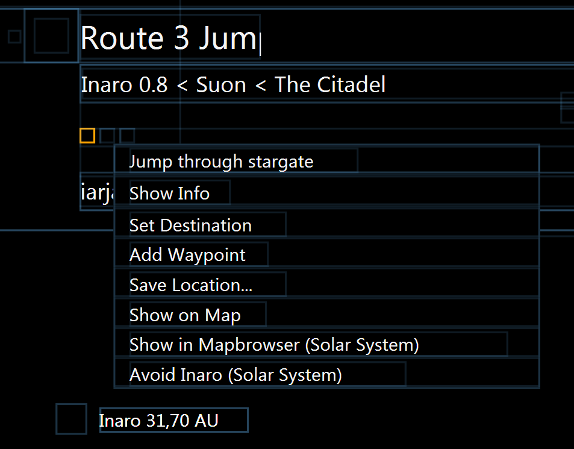

# Sanderling

**Sanderling is a framework that helps you create and run [eve online](https://www.eveonline.com) bots.**

### Features
* **safe**: does not inject into or write to the eve online client. That is why using it with eve online is not detectable.
* **accurate & robust**: Sanderling uses memory reading to retrieve information about the game state. In contrast to screen scraping, this approach won't be thrown off by a noisy background or non-default UI settings.
* **easy to use**: You will achieve quick results with the [integrated script engine](https://github.com/Arcitectus/Sanderling/wiki/Script-Engine) and API explorer.
* **comprehensive**: Sanderling is used to build mining, trading, mission running and [anomaly ratting](https://github.com/botengine-de/A-Bot) bots.

### Requirements
* the application requires Microsoft .NET Framework 4.6.1 which can be downloaded from [https://www.microsoft.com/download/details.aspx?id=49982](https://www.microsoft.com/download/details.aspx?id=49982).

### Download
Download the latest release from the [release section](https://github.com/Arcitectus/Sanderling/releases).

### Bot Creators
[Bot Creator Guide](https://github.com/Arcitectus/Sanderling/wiki/Bot-Creator-Guide)

### Bot Users
[Getting Started Guide](https://github.com/Arcitectus/Sanderling/wiki/Getting-Started)

### Building from source
The source code uses C# 7 features. It is recommended to use [Visual Studio](https://www.visualstudio.com/) version 2017 or newer for building.

### Feedback
Spotted a bug or have a feature request? File an issue [here](https://github.com/Arcitectus/Sanderling/issues) or at the [forum](http://forum.botengine.de/c/botting/eve-online).

### Need Help?
Got a question or need help with the development of your bot? Leave a message at [http://forum.botengine.de/c/botting/eve-online](http://forum.botengine.de/c/botting/eve-online).

    

