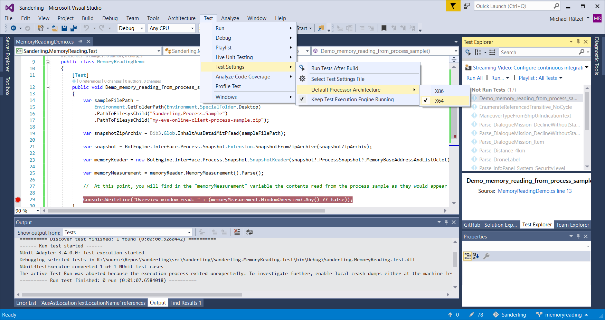

# How to Adapt EVE Online Memory Reading

Sometimes you might want to read more from the EVE Online clients' memory than you get with the mainstream version of Sanderling. Maybe you want to use the Planetary Interaction UI and found it is not implemented yet in Sanderling. Or maybe CCP made a change to the EVE Client which broke memory reading, [as happened in 2017 with list views](https://forum.botengine.org/t/no-entries-after-last-eve-update/217).

This guide shows how you can adapt the memory reading the way you need it.


## Learning from History

To understand how such adaptions look like in the implementation, it can help to look at the history of EVE Online memory reading development.
An excellent source to study is the directory `src/Sanderling/Sanderling.MemoryReading/Production` in the Sanderling repository. You can see the history of this directory here:
https://github.com/Arcitectus/Sanderling/commits/master/src/Sanderling/Sanderling.MemoryReading/Production


## Approach

The botengine/sanderling framework brings tools which make it easy to reproduce the memory reading without the need to start up an actual EVE Online client instance for the development.

To develop new features or fix failing portions of the memory reading, first take a sample of an EVE Online client process which serves as an example for the deviation to be corrected.
See the guide at [https://forum.botengine.org/t/how-to-collect-samples-for-memory-reading-development/50](https://forum.botengine.org/t/how-to-collect-samples-for-memory-reading-development/50) for how to save such a sample to a file. This sample file contains a screenshot as well as the memory contents of the chosen process. During development, the screenshot can be used as a reference of what the memory reading implementation should find in the memory contained in the same sample.


## Reproduce the Memory Reading Result from a Process Sample File

The C# method [`Demo_memory_reading_from_process_sample`](./../src/Sanderling/Sanderling.MemoryReading.Test/MemoryReadingDemo.cs#L14) in the sanderling source code demonstrates how to apply the memory reading on a process sample file.
Since this method is marked as a test entry point, you can directly invoke it, for example from the Visual Studio test explorer.
You might need to set `X64` as the `Default Processor Architecture` in the Visuals Studio `Test Settings` and then rebuild, to make the test entry point show up in the test explorer.
The screenshot below shows how to reach this setting in Visuals Studio 2017:


## Explore a Sample

Now that you know how to reproduce the memory reading from a filed sample, the next step is to explore the sample.
Looking back at the history of changes, I learned the following: Most of the time, changes are done in the part after the partial extraction of python objects. In the demo method, this is the part after the assignment to `memoryMeasurementPartialPythonModel`.
I cover this part here first, because most of the time, people find what they need in `memoryMeasurementPartialPythonModel`.

So what is this thing? `memoryMeasurementPartialPythonModel` is the root of a tree, containing all the information that is mapped into the instances of `IMemoryMeasurement` that you find in the Sanderling IDE or the API explorer.

You can enumerate all the nodes in this tree:
```c#
var allNodesFromMemoryMeasurementPartialPythonModel =
    memoryMeasurementPartialPythonModel.EnumerateNodeFromTreeDFirst(node => node.GetListChild())
    .ToList();

Console.WriteLine($"The tree in memoryMeasurementPartialPythonModel contains { allNodesFromMemoryMeasurementPartialPythonModel.Count } nodes");
```

Depending on the sample you are using, the number of nodes in the UI tree will vary:
```console
The tree in memoryMeasurementPartialPythonModel contains 1656 nodes
```
