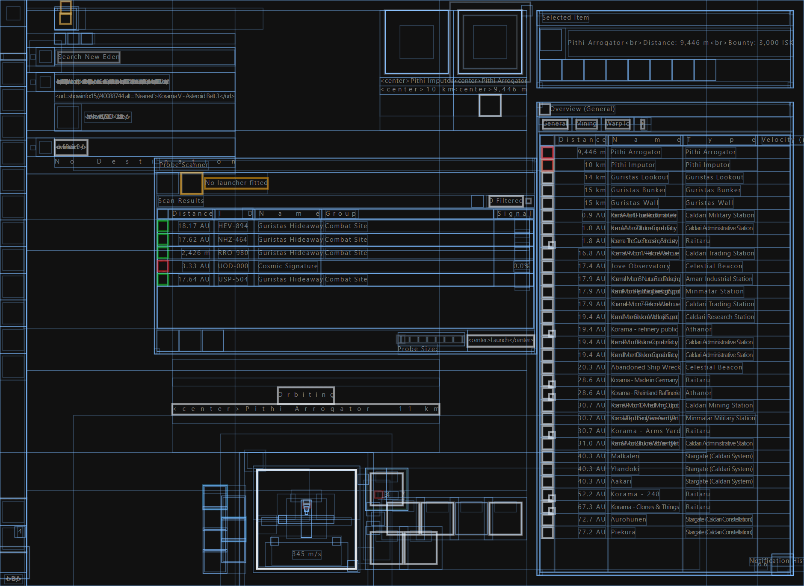
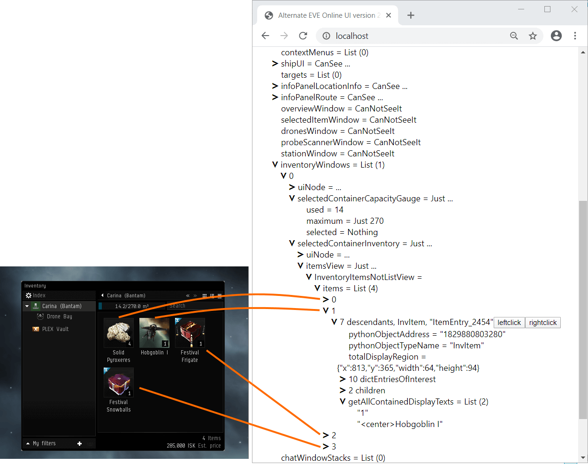

# Alternate UI for EVE Online


The alternate UI is a web-based user interface for the EVE Online client. Because of the HTML based rendering, this user interface is better accessible with screen-readers.

The alternate UI also lets you play the game from other devices that cannot run the EVE Online client but have a web browser. This way, you can play the game from your android smartphone or iPhone. This remote-play is possible because of the division into a frontend and backend, which communicate only via HTTP. The backend runs on the same machine as the EVE Online client and runs an HTTP server. The web-based frontend then connects to this HTTP server to read the game client's contents and send input commands.

This tool also shows the UI tree from the game client and presents the properties of the UI nodes in text form.



There can be more than a thousand nodes in the UI tree, even in simple scenarios. And each of the nodes, in turn, can have many properties. So we have tens of thousands of properties in the UI tree when more objects are on the screen.

This quantity might make for a confusing impression, so I introduced a way to better focus on what is of interest to you in a given moment: You can expand and collapse individual nodes of the UI tree. For a collapsed node, it only shows a small summary, not all properties. When you get the first memory reading, all nodes are displayed collapsed, so only the summary of the root node is shown. You can expand that, and then the children of the root node. This way, you can descend into the part you are interested in.



There are two ways to get a memory reading into this interface:

+ Load from a live EVE Online client process. This user interface offers you input elements to interact with input elements in the EVE Online client. Note: When you send an input to the EVE Online client this way, the tool will switch the input focus to the EVE Online window and bring to the foreground. In case you run this user interface on the same desktop as the EVE Online client: To avoid interference between web browser window and game client window, place them side-by-side, so that they don't overlap.

+ Load from a file: You can load memory readings in JSON format you have saved earlier. Since this memory reading does not correspond to a live process, we use this option only to explore the general structure of information found in the game client's memory.

## Guide on the Parsing Library and Examples

Besides the program to read the UI tree from the game client, there is also a parsing library to help you make sense of the raw UI tree.

For a guide on the structures in the parsed memory reading, see https://to.botlab.org/guide/parsed-user-interface-of-the-eve-online-game-client

Developers use the parsing library to make ratting, mining, and mission running bots and intel tools. Following are some links to bots and tools using the parsing library:

+ <https://forum.botlab.org/t/list-of-eve-online-bots-for-beginners/629>
+ <https://catalog.botlab.org/?q=eve%2Bonline>

## Setup

These instructions to run the alternate UI start with the program source code. Here we use a tool called `elm-time` to compile the program from source code and run it as a web server.

Download the zip archive from <https://github.com/elm-time/elm-time/releases/download/v2024-02-17/elm-time-separate-assemblies-d4a29168fd0195b3f507c8ef023acc26942df0c0-win-x64.zip> and extract it.

The extracted files contain the `elm-time` tool used to run Elm programs.

## Usage

To start the software:

+ Start PowerShell.
+ In the next command, we use the `elm-time.exe` file we got from the zip archive in the setup section. Below is an example of the complete command; you only need to replace the file path to the executable file:

```txt
."C:\replace-this-the-path-on-your-system\elm-time.exe"  run-server  --public-urls="http://*:80"  --deploy=https://github.com/Arcitectus/Sanderling/tree/dd6ca58e26a217e79261e0d6f2f597804f5b558a/implement/alternate-ui/source
```

+ The command starts a web server and the shell window will display an output like this:

```txt
I got no path to a persistent store for the process. This process will not be persisted!
Loading app config to deploy...
This path looks like a URL into a remote git repository. Trying to load from there...
This path points to commit dd6ca58e26a217e79261e0d6f2f597804f5b558a
Loaded source composition 575233c29caee8611794fd8306a4d341a3e911315b5b844cb78b326e3676b349 from 'https://github.com/Arcitectus/Sanderling/tree/dd6ca58e26a217e79261e0d6f2f597804f5b558a/implement/alternate-ui/source'.
Starting web server with admin interface (using engine JavaScript_V8)...
info: ElmTime.Platform.WebService.StartupAdminInterface[0]
      Begin to build the process live representation.
info: ElmTime.Platform.WebService.StartupAdminInterface[0]
      Begin to restore the process state.
info: ElmTime.Platform.WebService.StartupAdminInterface[0]
      Found 1 composition log records to use for restore.
info: ElmTime.Platform.WebService.StartupAdminInterface[0]
      Restored the process state in 0 seconds.
info: ElmTime.Platform.WebService.StartupAdminInterface[0]
      Completed building the process live representation.
info: ElmTime.Platform.WebService.PublicAppState[0]
      I did not find 'letsEncryptOptions' in the configuration. I continue without Let's Encrypt.
info: Microsoft.Hosting.Lifetime[14]
      Now listening on: http://[::]:80
info: Microsoft.Hosting.Lifetime[0]
      Application started. Press Ctrl+C to shut down.
info: ElmTime.Platform.WebService.StartupAdminInterface[0]
      Started the public app at 'http://*:80'.
Completed starting the web server with the admin interface at 'http://*:4000'.
```

+ As the program keeps running, it will eventually write more to the same shell window, so the last output there can become something else.
+ With the command above, the program will try to use network port 80 on your system. In case this network port is already in use by another process, the command fails. In this case you get an error message containing the following text:

> System.IO.IOException: Failed to bind to address http://[::]:80: address already in use.

After starting the web server, you don't need to look at the shell window anymore, but leave it in the background. Closing the shell window would also stop the web server process.

Use a web browser (tested with Chrome and Firefox) to navigate to http://localhost:80/
There you find the Alternate EVE Online UI.

At the top, you find a section titled 'Select a source for the memory reading'. Here are two radio buttons to choose between the two possible sources:

+ From file
+ From live game client process

### Reading from file

Here you can load memory readings from JSON files.
After loading a memory reading, you can inspect it:

> Successfully read the reading from the file. Below is an interactive tree view to explore this reading. You can expand and collapse individual nodes.

### Reading from live process

When reading from a live process, the system needs to perform a setup steps, including the search for the root of the UI tree in the EVE Online client process. During the setup stage you will see diverse messages informing about the current step.

The memory reading setup should complete within 20 seconds. 

If no EVE Online client is started, it displays following message:

> Looks like there is no EVE Online client process started. I continue looking in case one is started...

As long as reading from live process is selected, the program tries once per seconds to get a new memory reading from the game client.

When setup is complete you see following message:

> Successfully read from the memory of the live process

Below is a button labeled:

> Click here to download this reading to a JSON file.

The memory reading file you can download here is useful for collaboration: In the 'Reading from file' section, people can load this file into the UI to see the same memory reading that you had on your system. 

Under the save button, you get tools for closer examination of the memory reading:

> Below is an interactive tree view to explore this reading. You can expand and collapse individual nodes.

### Enabling the Elm Inspection ('Debugger') Tool

To use the Elm inspection tool in the frontend, open the page http://localhost:80/with-inspector instead of http://localhost:80
