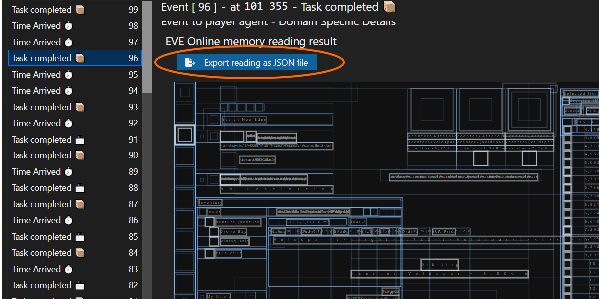

# Read Memory From the 64-Bit EVE Online Client

For a guide on the functionality not specific to EVE Online, see <https://github.com/Viir/bots/blob/main/guide/how-to-collect-samples-for-64-bit-memory-reading-development.md>

## read-memory-64-bit.exe

This software helps you read from 64-bit game client processes.

To download the latest version of `read-memory-64-bit.exe`, see the list of releases at <https://github.com/Arcitectus/Sanderling/releases>

### Interactive Guide

To see a guide on available (sub)commands, run the following command:

```
./read-memory-64-bit.exe  --help
```

### `--pid` option

The `--pid` option exists on several commands and lets us select a process to read from.
It specifies the ID of the game client process assigned by the Windows operating system. You can find this ID in the Windows Task Manager in the `PID` column in the `Processes` tab.

### save-process-sample

The `save-process-sample` command saves a sample of the process to a file. This sample includes all committed memory regions, so we can use it to support memory reading development.

Below is an example of a full command to use the tool:
```cmd
read-memory-64-bit.exe  save-process-sample  --pid=12345
```

### read-memory-eve-online

The `read-memory-eve-online` command produces an EVE Online memory reading of the given process. Supports saving to a JSON file using the `--output-file` option.

The JSON file format here is the same one you get when exporting the memory reading using the development tools in the BotLab client.

If you find the timing too tricky with the command-line interface or want to export from specific events of a larger session recording, exporting from the session timeline in BotLab is easier. After selecting an event in the bot session or play session, use the button labeled 'Export reading as JSON file' to get the memory reading in a separate file:



## Sources

+ Discussion of the approach to read the UI Tree from the EVE Online client process. (Artifacts for 32-bit back then):
https://forum.botlab.org/t/advanced-do-it-yourself-memory-reading-in-eve-online/68

I found some articles that might help understand CPython in general:

+ Your Guide to the CPython Source Code: [https://realpython.com/cpython-source-code-guide/#memory-management-in-cpython](https://realpython.com/cpython-source-code-guide/#memory-management-in-cpython)
+ Python consumes a lot of memory or how to reduce the size of objects? [https://habr.com/en/post/458518/](https://habr.com/en/post/458518/)
