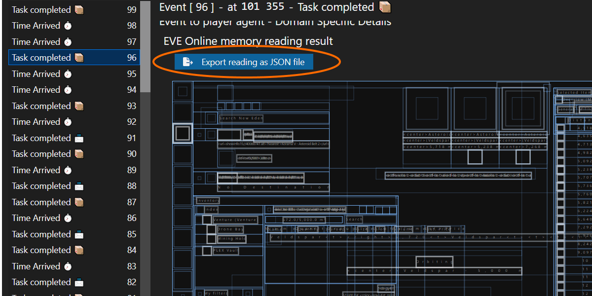

# Sanderling

**Sanderling helps you read information from the [EVE Online](https://www.eveonline.com) game client using memory reading.**

Sanderling is the eyes of bots and monitoring tools. It helps programs see the game client in a structured way, detecting objects and reading information about the game world. It also reads the locations of elements in the game clients' graphical user interface (e.g., in-game windows, overview entries, buttons, etc.). You can use this information to interact with the game client using mouse input.

 

 

## Features

+ **safe**: does not inject into or write to the EVE Online client. That is why using it with EVE Online is not detectable.
+ **accurate & robust**: Sanderling uses memory reading to get information about the game state and user interface. In contrast to screen scraping, this approach won't be thrown off by a noisy background or non-default UI settings.
+ **comprehensive**: Sanderling memory reading is used in [mining](https://to.botlab.org/guide/app/eve-online-mining-bot), trading, mission running and [anomaly](https://to.botlab.org/guide/app/eve-online-combat-anomaly-bot) bots.

## Repository contents

Below is an overview of the software components maintained in this repository. The tools and projects listed below come primarily in the form of source code, and you might have to build them from source if you want to use the latest version. For guidance on the build process(es), see the respective subdirectories containing the source codes.
If you don't want to build the tools from source, you can find pre-built and ready-to-execute binaries in the [`releases` section on GitHub](https://github.com/Arcitectus/Sanderling/releases).

### Memory reading library

This library implements the functionality to read from the memory of (64-bit) EVE Online client processes. It reads the UI tree from the game client user interface. It is written using the C# programming language, and the build output is the .NET Core assembly `read-memory-64-bit.dll`.

Location in the repository: [/implement/read-memory-64-bit](/implement/read-memory-64-bit)

### Tool to get and save process samples and memory readings

This software integrates multiple functions in a single executable file:

+ Saving process samples to files for later inspection, automated testing, and collaboration. This function is not specific to EVE Online but can be used with other game clients as well.
+ Reading the structures in the EVE Online clients' memory. You can let it read from a live process or a previously saved process sample. It also offers to save the memory reading results into a JSON file.

The compiled binary is distributed in the file `read-memory-64-bit.exe`.

Location in the repository: [/implement/read-memory-64-bit](/implement/read-memory-64-bit)

The JSON file format here is the same one you get when exporting the memory reading using the development tools in the BotLab client.

If you find the timing too tricky with the command-line interface or want to export from specific events of a larger session recording, exporting from the session timeline in BotLab is easier. After selecting an event in the bot session or play session, use the button labeled 'Export reading as JSON file' to get the memory reading in a separate file:

### Memory reading parsing library

This library takes the result of an EVE Online memory reading and transforms it into a format that is easier to use for integrating applications like bots.

When programming an app, we use functions to reach into the UI tree and extract the parts needed for our app. Sometimes the information we need is buried somewhere deep in the tree, contained in other nodes with redundant data. The structure we find in the UI tree is what CCP uses to build a visual representation of the game. It is not designed to be easily accessible to us, so it is not surprising to find many things there that we don't need for our applications and want to filter out.

To find things faster and automatically detect program code errors, we also use types adapted to the user interface's shape. We use the type system of the Elm programming language to assign names to parts of the UI tree describe the values that we expect in certain parts of the UI. The types provide us with names more closely related to players' experience, such as the overview window or ship modules.

The input for this library is the JSON string, as we get it from the memory reading.

For an overview of the building blocks that you can find in the memory reading parsing library, see https://to.botlab.org/guide/parsed-user-interface-of-the-eve-online-game-client

Location of the implementation in the repository: [/implement/alternate-ui/source/src/EveOnline/ParseUserInterface.elm](/implement/alternate-ui/source/src/EveOnline/ParseUserInterface.elm)

### Alternate UI for EVE Online

The alternate UI is a web-based user interface for the EVE Online client. Because of the HTML based rendering, this user interface is better accessible with screen-readers.

The alternate UI also lets you play the game from other devices that cannot run the EVE Online client but have a web browser. This way, you can play the game from your android smartphone or iPhone. This remote-play is possible because of the division into a frontend and backend, which communicate only via HTTP. The backend runs on the same machine as the EVE Online client and runs an HTTP server. The web-based frontend then connects to this HTTP server to read the game client's contents and send input commands.

Location of the alternate UI in the repository: [/implement/alternate-ui/](/implement/alternate-ui/)

## Bots and Intel Tools

The Sanderling repository contains no bots. However, developers often integrate the functionality from Sanderling in a bot to see and parse the game clients' user interface.

For a guide on developing complete bots and intel apps for EVE Online (using also Sanderling + image processing), see <https://to.botlab.org/guide/developing-for-eve-online>

Following is a selection of popular bots using Sanderling:

+ Warp-To-0 Autopilot: <https://to.botlab.org/guide/app/eve-online-autopilot-bot>

+ Mining asteroids: <https://to.botlab.org/guide/app/eve-online-mining-bot>

+ Combat anomalies: <https://to.botlab.org/guide/app/eve-online-combat-anomaly-bot>

+ List of EVE Online Bots for Beginners: <https://forum.botlab.org/t/list-of-eve-online-bots-for-beginners/629>

+ Up-to-date list of bots and intel-tools: <https://catalog.botlab.org/?q=eve%20online>

## Contributing

### Issues and other Feedback

Spotted a bug or have a feature request? Post on the [BotLab forum](https://forum.botlab.org) or file an issue [on GitHub](https://github.com/Arcitectus/Sanderling/issues).
For communication here, supported languages are English, Italian, Spanish, and German.

### Pull Requests

The only supported language for pull request titles and commit messages is English.

